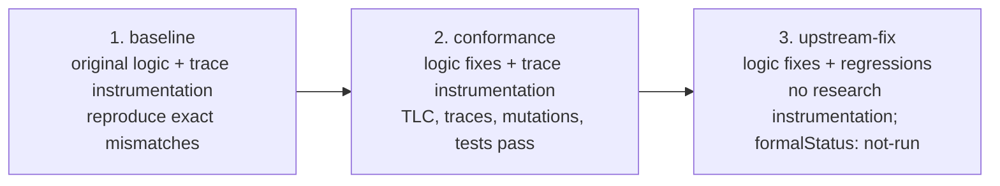

# Cordis Formal Study

English | [中文](README.zh-CN.md)

> **Research status — early-stage work in progress.** The complete TLA+ specification, paper-to-theorem mapping, and refinement rules still require human audit and independent review.

This independent, unofficial, reproducible study examines alignment among the Cordis paper, upstream Cordis, and the vendored Cordis in DeepSeek Harness. The paper determines the properties under validation; the implementations are validation subjects. [The locked Cordis `formal/` directory](https://github.com/Stool233/cordis/tree/112f71c2ecba8dc3b39d7e3f4c25834f0ef9337b/formal) is the sole executable-specification authority. This portal pins revisions, orchestrates reproduction, and explains the results.

## Research background

The study is motivated by [etcd/raft PR #113, “TLA+ Trace validation”](https://github.com/etcd-io/raft/pull/113): TLC checks an abstract algorithm model, while real execution traces check whether the implementation's observed states and transitions are accepted by that model, connecting specification and code.

[Specula](https://github.com/specula-org/Specula) organizes code analysis, specification generation, instrumentation, trace validation, model checking, and bug confirmation into an automated workflow. [Murat Demirbas's review of Specula](https://muratbuffalo.blogspot.com/2026/08/specula-scaling-formal-specifications.html) emphasizes the importance of independent specification provenance in avoiding circular evidence. This study derives the abstract properties under validation from definitions, lemmas, and theorems in the Cordis paper, treats the Cordis and DeepSeek Harness implementations as validation subjects, and checks whether the paper specification accepts their execution traces. It uses Specula's techniques for test instrumentation, deterministic trace generation, TLA+ cursor consumption and `TraceMatched`, TLC checking, and counterexample diagnosis.

## One-minute outcome

- The study connects paper-derived properties, bounded TLA+ models, implementation-trace refinement, ordinary regressions, and semantic mutations. Upstream and vendored Cordis share the core scenarios.
- Baseline preserves the original runtime logic and adds only test instrumentation. The locked results contain 9 mismatching trace scenarios and 4 failing behavior checks in Cordis, and 10 mismatching trace scenarios and 3 failing behavior checks in vendored Cordis. The numbers count scenarios and behavior checks; several scenarios can expose the same underlying issue through different schedules.
- Investigation groups the evidence into two paper-related deviations: provider recovery/retirement ordering, and publication ordering for lifecycle, target, and committed view. Ordinary regression testing also found one adjacent transitive-activation scheduling issue.
- The corrected conformance stage passes 13 Cordis core traces, 17 complete vendored traces, 29 observation points, 4 semantic mutants, the bounded PR models, and relevant ordinary tests.
- The upstream-fix stage removes research instrumentation and keeps only logic corrections and regression tests. It explicitly reports `formalStatus: "not-run"`; its formal rationale points to the conformance revisions that exercise the same logic fixes.

See [Research process and results](docs/results.md) for the complete evidence and interpretation.

## Three-stage research process



| Stage | Cordis | DeepSeek Harness | One-command reproduction | What success means |
| --- | --- | --- | --- | --- |
| `baseline` | [`research/paper-trace-baseline` @ `48c4604`](https://github.com/Stool233/cordis/tree/48c4604005b80b4e4fd7706088f5b721a16ea8de) | [`research/paper-trace-baseline` @ `59c8608`](https://github.com/Stool233/deepseek-harness/tree/59c86088a75c4afe99d28244baedaa159231c46c) | `npm run reproduce:baseline` | Exits zero only when the exact locked 9/10 trace mismatches and 4/3 behavior failures are reproduced. |
| `conformance` | [`research/paper-conformance` @ `112f71c`](https://github.com/Stool233/cordis/tree/112f71c2ecba8dc3b39d7e3f4c25834f0ef9337b) | [`research/paper-conformance` @ `8a85249`](https://github.com/Stool233/deepseek-harness/tree/8a85249fc94dc94608937041674950660d787f01) | `npm run reproduce:conformance` | Bounded models, all traces, premise audits, mutations, AgentLoop, and ordinary regressions pass. |
| `upstream-fix` | [`fix/paper-conformance` @ `3120ba9`](https://github.com/Stool233/cordis/tree/3120ba9928bd5fe37e34f50e521077121000f050) | [`fix/paper-conformance` @ `6bb3cdd`](https://github.com/Stool233/deepseek-harness/tree/6bb3cdd9ca9b5dcb1019a6a9caf0307ef89c27f3) | `npm run reproduce:upstream-fix` | Trace/formal research code is absent, ordinary source gates pass, and the report records `formalStatus: "not-run"`. |

The three branches preserve successive reproducible snapshots of the research process: baseline records observations from the original implementation, conformance records instrumented validation of the corrections, and upstream-fix records the trace-free logic patch and regression tests. `study.lock.json` makes the stage order, branch roles, complete SHAs, and expected outcomes machine-checkable.

## What the study found

| Finding | Baseline behavior | Paper property | Correction and final evidence |
| --- | --- | --- | --- |
| Provider recovery and retirement ordering | A provider inverse could run before asynchronous consumer teardown completed; a retiring consumer could disappear from discovery too early. | Recovery exactness, Ordering, and retirement/visibility invariants | Keep retiring consumers discoverable until quiescence and await notified dependents before restoring the provider accumulator; traces and lifecycle regressions pass. |
| Lifecycle, target, and committed publication | An incompatible target or committed provider could become visible before the corresponding lifecycle transition, exposing a stale binding. | Preservation, Resolution coherence, and committed-lifecycle invariants | Publish lifecycle transitions before incompatible target/committed changes and compare provider identity; the traces and identity mutant pass. |
| Transitive activation scheduling | An awaited provider could return while a transitive consumer remained `LOADING`. | An adjacent implementation scheduling regression, motivated by progress but not claimed as a standalone paper-theorem counterexample. | Remove the duplicate deferred cancellation checkpoint while preserving stale-activation invalidation; ordinary regression and corrected traces pass. |

The investigations into concurrent recovery of independent top-level effects and the distinction between `Plugin.provide` and dynamic `ctx.provide()` produced two applicability-boundary notes. See [Results](docs/results.md#investigated-but-not-classified-as-defects) for details.

## Reproduce by goal

Requirements are Node.js 24, Java 21, Git, and Corepack. The first run needs network access for source and dependencies; downloaded TLA+ JARs are checked against pinned hashes.

```sh
git clone https://github.com/Stool233/cordis-formal-study.git
cd cordis-formal-study
npm ci
npm run bootstrap:study
```

Then choose a goal:

| Goal | Command |
| --- | --- |
| Reproduce why the original implementation is rejected | `npm run reproduce:baseline` |
| Reproduce the complete corrected formal and implementation evidence | `npm run reproduce:conformance` |
| Inspect the trace-free patch intended for upstream review | `npm run reproduce:upstream-fix` |
| Reproduce the whole study in order and write aggregate reports | `npm run reproduce:study` |

`bootstrap:study` creates six detached, SHA-isolated checkouts under `.artifacts/checkouts/`. An existing checkout that is dirty or at the wrong HEAD is rejected, never reset or overwritten. A complete run writes `.artifacts/study-report.json` and the reader-oriented `.artifacts/study-report.md`. See [Reproduction](docs/reproduce.md) for commands, the output tree, and troubleshooting.

## Reading path

1. Use this README for the outcome and stage relationship.
2. Read [Research process and results](docs/results.md) for counterexamples, corrections, and evidence limits.
3. Follow [Reproduction](docs/reproduce.md) to rerun one stage or the full study.
4. Continue with [Method](docs/method.md) and [Architecture](docs/architecture.md).
5. Inspect the [authoritative Cordis `formal/` directory](https://github.com/Stool233/cordis/tree/112f71c2ecba8dc3b39d7e3f4c25834f0ef9337b/formal) for the TLA+ modules, theorem index, and runner.

## Pinned snapshot and CI

The browsable portal submodules pin the conformance revisions: [Cordis `112f71c`](https://github.com/Stool233/cordis/tree/112f71c2ecba8dc3b39d7e3f4c25834f0ef9337b), [English paper `948a07b`](https://github.com/cordiverse/paper/tree/948a07b369c62adb3b12e102458be5c18dfb69b9), and [DeepSeek Harness `8a85249`](https://github.com/Stool233/deepseek-harness/tree/8a85249fc94dc94608937041674950660d787f01). [`study.lock.json`](study.lock.json) also pins the other four stage revisions, the paper PDF hash, toolchain, exact expected mismatch names, and evidence scale.

**Integrity** runs on every push and pull request without TLC. **Conformance** runs on relevant pull requests, relevant `main` pushes, or manual dispatch; manual runs select `baseline`, `conformance`, `upstream-fix`, or the default `study`. **Nightly** first reproduces all three stages, then runs the expanded stage-two model. **Release** packages evidence only after the three-stage and nightly checks pass.

## Evidence boundary

The conclusions provide conformance evidence for the locked revisions, finite models, explicit premises, and captured traces. Their scope covers modelled state, instrumented implementation actions, and exercised schedules; arbitrary JavaScript plugin side effects and unbounded execution remain outside that scope. Finite traces check observed termination and step bounds without covering infinite-horizon liveness.
