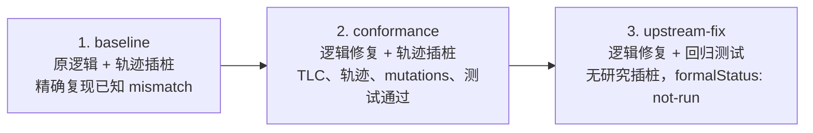

# Cordis 形式化研究

[English](README.md) | 中文

> **研究状态——早期进行中。** 完整 TLA+ 规格、论文定理映射和 refinement 规则仍需人工审阅与独立复核。

这是一个独立、非官方、可复现的研究门户，用于检查 Cordis 论文、上游 Cordis 实现，以及 DeepSeek Harness 中的 vendored Cordis 是否一致。论文决定待验证的性质；实现是验证对象。[Cordis 固定 revision 的 `formal/` 目录](https://github.com/Stool233/cordis/tree/112f71c2ecba8dc3b39d7e3f4c25834f0ef9337b/formal)是唯一权威的可执行规格，本门户负责固定版本、编排复现和解释结果。

## 研究背景

本研究受 [etcd/raft PR #113「TLA+ Trace validation」](https://github.com/etcd-io/raft/pull/113)启发：TLC 检查抽象算法模型，真实执行轨迹检查实现经历的状态与转换能否被模型接受，从而连接规格与代码。

[Specula](https://github.com/specula-org/Specula) 将代码分析、规格生成、插桩、轨迹验证、模型检查和缺陷确认组织成自动化流程。[Murat Demirbas 对 Specula 的评论](https://muratbuffalo.blogspot.com/2026/08/specula-scaling-formal-specifications.html)强调规格来源独立性对避免循环论证的重要性。本研究从 Cordis 论文的定义、引理和定理中提取待检查的抽象性质，把 Cordis 与 DeepSeek Harness 中的实现作为验证对象，并检查其执行轨迹能否被论文规格接受。我们参考 Specula 的测试插桩、确定性轨迹生成、TLA+ 游标消费与 `TraceMatched`、TLC 检查和反例调试技术。

## 一分钟结论

- 我们建立了“论文性质 → TLA+ 有界模型 → 实现轨迹 refinement → 普通回归与 mutations”的证据链，并让上游 Cordis 与 vendored Cordis 共用核心场景。
- baseline 保留原有运行逻辑，只增加测试插桩。锁定结果为：Cordis 有 9 个轨迹场景发生 mismatch、4 项行为检查失败；vendored Cordis 有 10 个轨迹场景发生 mismatch、3 项行为检查失败。计数单位是场景或行为检查；多个场景可以从不同调度路径暴露同一个底层问题。
- 调查将结果归纳为两类论文相关偏差：provider recovery/retirement 顺序，以及 lifecycle、target、committed view 的发布顺序；普通回归还发现一项相邻的传递激活调度问题。
- 加入逻辑修复的 conformance 阶段通过 13 条 Cordis 核心轨迹、17 条 vendored 完整轨迹、29 个观测点、4 个语义 mutant、PR 有界模型和相关普通测试。
- 面向后续上游 PR 的 upstream-fix 阶段移除了研究插桩，只保留逻辑修复与回归测试。该阶段明确报告 `formalStatus: "not-run"`；它的形式化依据来自包含相同逻辑修复的 conformance revision。

完整证据和解释见[研究过程与结果](docs/results.zh-CN.md)。

## 三阶段研究流程



| 阶段 | Cordis | DeepSeek Harness | 一键复现 | 成功的含义 |
| --- | --- | --- | --- | --- |
| `baseline` | [`research/paper-trace-baseline` @ `48c4604`](https://github.com/Stool233/cordis/tree/48c4604005b80b4e4fd7706088f5b721a16ea8de) | [`research/paper-trace-baseline` @ `59c8608`](https://github.com/Stool233/deepseek-harness/tree/59c86088a75c4afe99d28244baedaa159231c46c) | `npm run reproduce:baseline` | 只在 9/10 条轨迹 mismatch 和 4/3 项行为失败与 lock 完全一致时返回 0。 |
| `conformance` | [`research/paper-conformance` @ `112f71c`](https://github.com/Stool233/cordis/tree/112f71c2ecba8dc3b39d7e3f4c25834f0ef9337b) | [`research/paper-conformance` @ `8a85249`](https://github.com/Stool233/deepseek-harness/tree/8a85249fc94dc94608937041674950660d787f01) | `npm run reproduce:conformance` | 有界模型、全部轨迹、前提审计、mutations、AgentLoop 与普通回归均通过。 |
| `upstream-fix` | [`fix/paper-conformance` @ `3120ba9`](https://github.com/Stool233/cordis/tree/3120ba9928bd5fe37e34f50e521077121000f050) | [`fix/paper-conformance` @ `6bb3cdd`](https://github.com/Stool233/deepseek-harness/tree/6bb3cdd9ca9b5dcb1019a6a9caf0307ef89c27f3) | `npm run reproduce:upstream-fix` | trace/formal 研究代码已移除，普通源码门禁通过，报告记录 `formalStatus: "not-run"`。 |

三个分支依次保存研究过程中的三个可复现快照：baseline 记录原实现的观测结果，conformance 记录带插桩的修复验证，upstream-fix 记录移除插桩后的逻辑补丁与回归测试。`study.lock.json` 把阶段顺序、分支角色、完整 SHA 和预期结果写成机器可检查的事实。

## 发现了什么

| 发现 | baseline 表现 | 对应论文性质 | 修复与最终证据 |
| --- | --- | --- | --- |
| Provider recovery 与 retirement 顺序 | provider inverse 可在异步 consumer teardown 完成前执行；退休中的 consumer 可能过早从可发现集合消失。 | Recovery exactness、Ordering、retirement/visibility invariants | 保留 retiring consumer 至 quiescence，并在恢复 provider accumulator 前等待已通知 dependents；轨迹与普通生命周期回归通过。 |
| Lifecycle、target 与 committed 发布顺序 | 不兼容 target 或 committed provider 可能在相应 lifecycle 转换完成前可见，造成 stale binding。 | Preservation、Resolution coherence、committed lifecycle invariants | 先发布 lifecycle 转换，再暴露 target/committed 变化，并按 provider identity 检查绑定；相关轨迹和 identity mutant 通过。 |
| 传递激活调度 | 已等待的 provider 返回时，传递 consumer 仍可能停在 `LOADING`。 | 相邻实现调度回归；由论文进展目标启发，但不单独宣称为论文定理反例。 | 移除重复的延迟取消检查点，同时保留 stale activation 失效；普通回归与修复后轨迹通过。 |

对顶层独立 effects 并发恢复，以及 `Plugin.provide` 与动态 `ctx.provide()` 差异的调查，形成了两项适用性边界说明。详情见[结果文档](docs/results.zh-CN.md#已调查但未归类为缺陷)。

## 按目标复现

需要 Node.js 24、Java 21、Git 和 Corepack。首次运行需要网络来取得源码与依赖；TLA+ JAR 会按固定哈希校验。

```sh
git clone https://github.com/Stool233/cordis-formal-study.git
cd cordis-formal-study
npm ci
npm run bootstrap:study
```

然后选择目标：

| 目标 | 命令 |
| --- | --- |
| 复现原实现为何被拒绝 | `npm run reproduce:baseline` |
| 复现逻辑修复后的完整形式化与实现证据 | `npm run reproduce:conformance` |
| 检查适合上游评审的无插桩补丁 | `npm run reproduce:upstream-fix` |
| 按顺序复现完整研究并生成聚合报告 | `npm run reproduce:study` |

`bootstrap:study` 在 `.artifacts/checkouts/` 中为六个实现 revision 创建 detached、按 SHA 隔离的 checkout。已有 checkout 只要 dirty 或 HEAD 不匹配就会失败，不会 reset 或覆盖。完整运行会生成 `.artifacts/study-report.json` 和便于阅读的 `.artifacts/study-report.md`。命令、输出树和排错方式见[复现指南](docs/reproduce.zh-CN.md)。

## 阅读路径

1. 从本 README 获取结论和三阶段关系。
2. 阅读[研究过程与结果](docs/results.zh-CN.md)，了解反例、修复和证据边界。
3. 按[复现指南](docs/reproduce.zh-CN.md)重跑某一阶段或完整研究。
4. 再阅读[方法](docs/method.zh-CN.md)和[架构](docs/architecture.zh-CN.md)。
5. 最后进入[权威 Cordis `formal/` 目录](https://github.com/Stool233/cordis/tree/112f71c2ecba8dc3b39d7e3f4c25834f0ef9337b/formal)检查 TLA+ 模块、定理索引和 runner。

## 固定快照与 CI

门户可浏览的 submodule 固定到 conformance revisions：[Cordis `112f71c`](https://github.com/Stool233/cordis/tree/112f71c2ecba8dc3b39d7e3f4c25834f0ef9337b)、[英文论文 `948a07b`](https://github.com/cordiverse/paper/tree/948a07b369c62adb3b12e102458be5c18dfb69b9)和 [DeepSeek Harness `8a85249`](https://github.com/Stool233/deepseek-harness/tree/8a85249fc94dc94608937041674950660d787f01)。[`study.lock.json`](study.lock.json) 还固定另外四个阶段 revision、论文 PDF 哈希、工具链、完整预期 mismatch 名称和证据规模。

**Integrity** 在每次 push/PR 运行，不执行 TLC。**Conformance** 在相关 PR、`main` push 或手动触发时运行；手动触发可选择 `baseline`、`conformance`、`upstream-fix` 或默认的 `study`。**Nightly** 每周先复现完整三阶段，再运行扩大的阶段二模型。**Release** 只有三阶段与 nightly 全部通过后才打包证据。

## 结论边界

当前结论构成针对 lock 固定 revisions、有限模型、显式前提和已采集轨迹的一致性证据。覆盖范围止于模型表达的状态、已插桩的实现动作和已运行的调度；任意 JavaScript 插件外部副作用与无界执行仍在范围之外。有限轨迹只检查已观察到的终止与步数，不覆盖无限时域活性。
